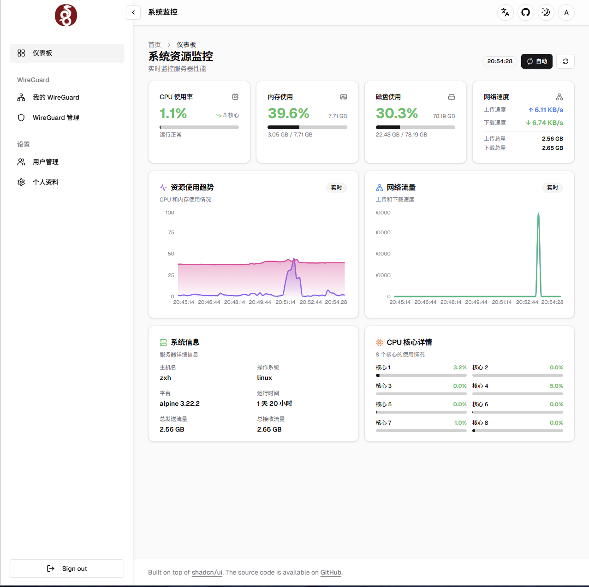
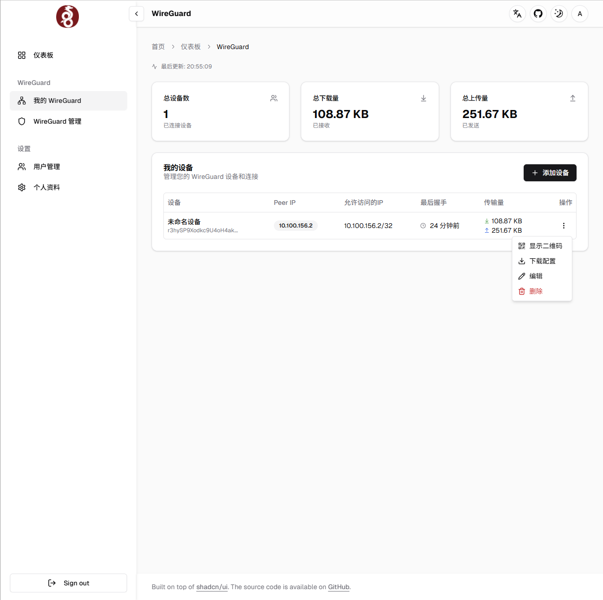
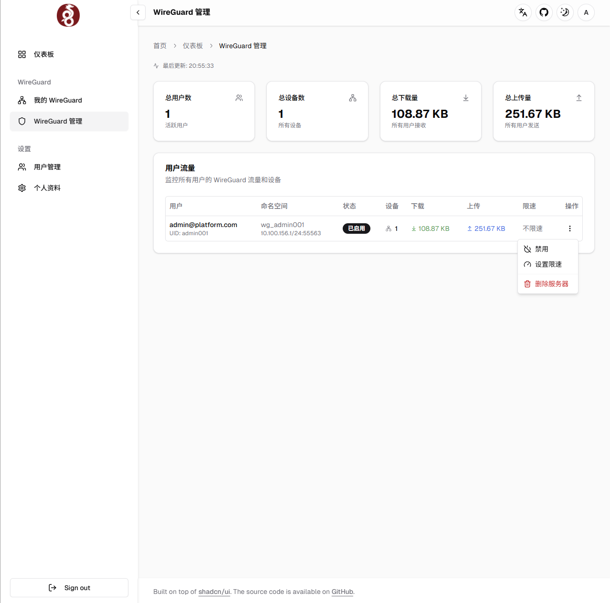

# WireGuard VPN Manager

基于 Go + Next.js 的 WireGuard 管理平台，提供可视化配置、命名空间隔离及实时监控。多用户管理，每个用户的server都在一个命名空间内，目前用于组内成员自用。





## 功能亮点
- 多用户隔离：每个账号独立 network namespace，互不影响。
- 自动化运维：自动创建接口、路由和 iptables 规则。
- 设备管理：一键生成 Peer 配置，支持文件与二维码导出。
- 实时监控：流量曲线、握手状态与系统资源。
- 现代界面：响应式设计、深色模式、中英文国际化。

## 架构概览
- 后端（Go + Gin + GORM）：运行在主机网络，负责 WireGuard 与数据库交互。
- 前端（Next.js 14 standalone）：通过 rewrites 代理后端 API。
- 数据库（PostgreSQL 16）：持久化用户、节点与监控数据。
- 共享命名空间（/var/run/netns）：确保主机可直接管理容器创建的 netns。

## 快速部署
```bash
git clone https://github.com/ChouHX/WireguardManager.git
cd WireguardManager

cp .env.example .env
cp config.yaml.example config.yaml
# 修改 config.yaml，填写 server_ip、out_interface 等

./deploy.sh     # 推荐
# 或手动执行:
docker compose build
docker compose up -d
```

访问 `http://<SERVER_IP>:3000`，默认账号 `admin@platform.com` / `password`。

## 本地开发
``` bash
# 前端
cd frontend && pnpm install
pnpm dev
# 数据库
docker compose -f docker-compose-db.yml up -d
# 后端
go mod tidy
sudo go run main.go
# 清理环境  --- 清理所有数据并重启数据库
sudo ./scripts/clean_all.sh
```

## 目录说明
- `config.yaml`：后端配置。
- `frontend/`：Next.js 前端源码。
- `wg_config/`：挂载至 `/etc/wg_config`，存放 WireGuard 配置。
- `postgres_data`（volume）：PostgreSQL 数据卷。

## 环境要求
- Linux 主机，具备 root 或 sudo 权限。
- Docker 24+ 与 Docker Compose v2。
- WireGuard 内核模块（`modprobe wireguard`）。
- 手动部署需 Go 1.21+、Node.js 18+、pnpm。

## 常用命令
```bash
docker compose ps
docker compose logs -f backend
docker compose restart frontend
docker compose down
```