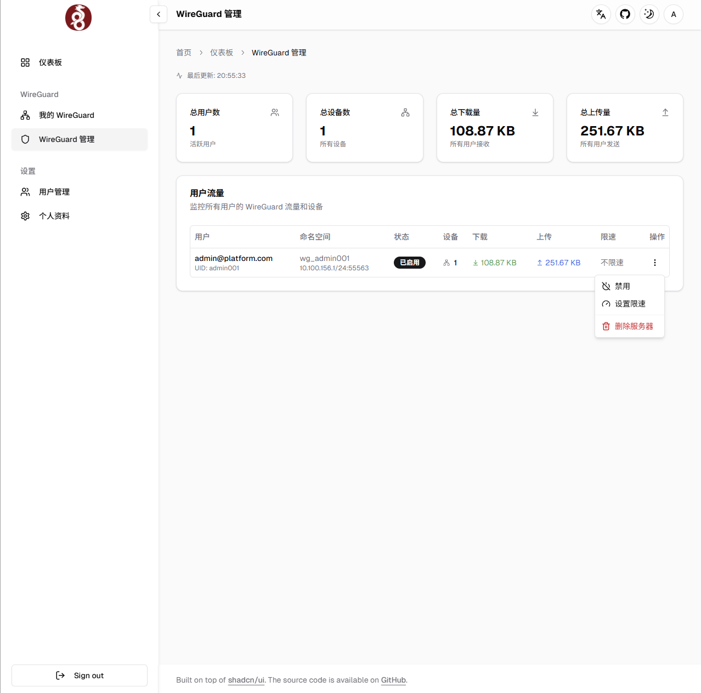

# WireGuard VPN Manager

基于 Go + React 的 WireGuard 管理平台，提供可视化配置、命名空间隔离及实时监控。多用户管理，每个用户的 server 都运行在独立 network namespace 内，目前用于组内成员自用。




> 截图取自旧版 interface；当前前端已用 React 19 + Vite + MantineUI 重写，功能与页面结构保持一致。

## 功能亮点

- 多用户隔离：每个账号独立 network namespace，互不影响。
- 自动化运维：自动创建接口、路由和 iptables 规则，失败自动回滚。
- 设备管理：一键生成 Peer 配置，支持文件下载与二维码导入。
- 实时监控：系统资源、流量曲线、握手状态与设备流量统计。
- 现代界面：React 19 + MantineUI 重构，响应式布局、明暗主题、中英文国际化。

## 架构概览

- 后端（Go 1.23 + Gin + GORM）：运行在主机网络，负责 WireGuard 操作、命名空间编排与数据库交互。
- 前端（React 19 + Vite + MantineUI）：构建为静态产物，由 Nginx 托管并反向代理 `/api`。
- 数据库（嵌入式 SQLite）：纯 Go 驱动（`glebarez/sqlite`，无需 CGO），单文件持久化用户、节点与监控数据，不需要独立数据库服务。
- 共享命名空间（`/var/run/netns`）：确保主机可直接管理容器创建的 netns。

## 快速部署

```bash
git clone https://github.com/ChouHX/WireguardManager.git
cd WireguardManager

cp .env.example .env
cp config.yaml.example config.yaml
# 修改 config.yaml，填写 server_ip、out_interface 等

./deploy.sh     # 推荐
# 或手动执行:
docker compose build
docker compose up -d
```

访问 `http://<SERVER_IP>:3000`，默认账号 `admin@platform.com` / `password`。

## 本地开发

```bash
# 后端（需要 root：涉及 netns / iptables；首次启动会自动创建 SQLite 数据库与默认管理员）
go mod tidy
sudo go run main.go

# 前端
cd frontend
npm install
npm run dev          # http://localhost:3000，自动代理 /api 到 localhost:8080

# 清理环境（删除全部 netns、WireGuard 配置与 SQLite 数据库文件）
sudo ./scripts/cleanup_all.sh
```

## 目录说明

- `config.yaml`：后端配置（数据库、JWT、网络、监控、默认管理员）。
- `frontend/`：React + Vite + MantineUI 前端源码。
- `internal/`：Go 后端（config / database / handlers / middleware / models / routes / services）。
- `wg_config/`：挂载至 `/etc/wg_config`，存放各用户的 WireGuard 配置。
- `data/`：SQLite 数据库文件目录（容器内映射为 `/root/data`，路径见 `database.path`）。

## 环境要求

- Linux 主机，具备 root 或 sudo 权限。
- Docker 24+ 与 Docker Compose v2。
- WireGuard 内核模块（`modprobe wireguard`）。
- 手动部署需 Go 1.23+、Node.js 20+（推荐 22）、npm。

## 常用命令

```bash
docker compose ps
docker compose logs -f backend
docker compose logs -f frontend
docker compose restart frontend
docker compose down
```
