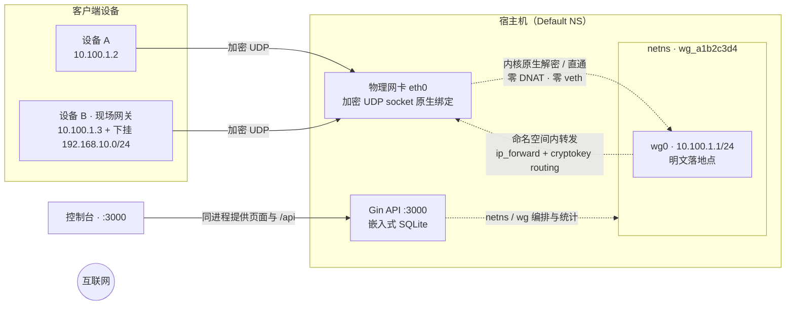

# WireGuard Manager

> 多用户 WireGuard 管理平台：账号级网络命名空间隔离，设备配置一键下发，流量与在线状态实时可见。

[](https://github.com/ChouHX/WireguardManager/actions/workflows/build-images.yml)
[](LICENSE)
[](https://go.dev)
[](https://react.dev)
[](https://mantine.dev)
[](https://github.com/ChouHX/WireguardManager/pkgs/container/wireguardmanager-backend)

## 目录

- [特性](#特性)
- [架构](#架构)
  - [网络资源模型](#网络资源模型)
- [快速开始](#快速开始)
- [配置参考](#配置参考)
  - [配置项](#配置项)
  - [环境变量](#环境变量)
  - [客户端配置](#客户端配置)
- [API](#api)
- [目录结构](#目录结构)
- [本地开发](#本地开发)
- [常用命令](#常用命令)
- [升级与灰度](#升级与灰度)
- [常见问题](#常见问题)
- [安全提示](#安全提示)
- [许可证](#许可证)

## 特性

- **账号级隔离** —— 每个账号独享一个 network namespace、独立的 WireGuard 接口与监听端口，互不可见、互不干扰。
- **命名空间原生加密信道** —— 加密 UDP socket 由内核固定在宿主命名空间收发，明文则落在账号命名空间内。全程没有 DNAT、没有 conntrack 回转，回程源端口恒等于监听端口，不存在端口漂移。
- **自动化编排** —— 注册即自动创建命名空间、隧道接口与路由；任一步失败自动回滚，不留半成品。
- **设备即开即用** —— 一键生成客户端配置，支持 `.conf` 下载与二维码扫码导入，转发出口自动探测。
- **秒级在线感知** —— 每 2 秒进入设备所属命名空间，向其隧道地址的高位端口发起一次 TCP 探测（纯 Go `setns`，无外部进程）：对端内核回 RST 或完成握手即为在线，连续无响应即离线，约 4 秒完成，不受 WireGuard 握手周期拖累。
- **流量与资源监控** —— 设备握手状态、收发流量、系统 CPU / 内存 / 磁盘 / 网络趋势一屏掌握。
- **精细管控** —— 设备粒度限速、启用禁用、网关转发（客户端侧 NAT，网卡按设备指定）、AllowedIPs 网段自定义，支持为单个设备启用预共享密钥（PSK）以增强抗中间人与抗量子能力。
- **零配置部署** —— 开箱即用：JWT 密钥首次启动自动生成并随数据一起持久化，网络与监控等参数全部在管理界面「系统设置」中调整；部署侧无需任何配置文件。
- **现代控制台** —— React 19 + Mantine，紧凑式布局、明暗主题、中英文双语、移动端自适应。
- **轻量部署** —— 嵌入式 SQLite（纯 Go 驱动，无需 CGO、无需独立数据库服务）；支持单容器部署，一个进程同时提供控制台与 API。镜像由 CI 构建并推送 GHCR。

## 架构


```mermaid
flowchart LR
  subgraph clients["客户端设备"]
    D1["设备 A<br/>10.100.1.2"]
    D2["设备 B · 现场网关<br/>10.100.1.3 + 下挂 192.168.10.0/24"]
  end

  subgraph host["宿主机（Default NS）"]
    direction TB
    ETH["物理网卡 eth0<br/>加密 UDP socket 原生绑定"]
    subgraph ns1["netns · wg_a1b2c3d4"]
      W1["wg0 · 10.100.1.1/24<br/>明文落地点"]
    end
    API["Gin API :3000<br/>嵌入式 SQLite"]
  end

  WEB["控制台 · :3000"]
  INET((互联网))

  D1 -- "加密 UDP" --> ETH
  D2 -- "加密 UDP" --> ETH
  ETH -. "内核原生解密 / 直通<br/>零 DNAT · 零 veth" .-> W1
  W1 -. "命名空间内转发<br/>ip_forward + cryptokey routing" .-> ETH
  WEB -- "同进程提供页面与 /api" --> API
  API -. "netns / wg 编排与统计" .-> ns1
```

加密信道的做法是 **WireGuard 原生跨命名空间**：网卡在宿主命名空间创建，内核据此把创建时的命名空间记进 `struct wg_device.creating_net`，此后每次接口 up 都在该命名空间重建 UDP socket，收发加密报文时的路由查找与源地址选择也都在该命名空间完成。网卡实体随后被移入账号命名空间，明文流量因此被封闭其中。

这条路径带来两个直接结果：客户端要连的端口就是宿主机上的监听端口，回程源端口恒等于它，**不存在端口漂移**；加密报文不经过任何转发、改写或连接跟踪，**没有 conntrack 回转可丢包**。

需要注意的内核语义（实现中已按此编排）：移入命名空间会让接口强制 down 并销毁 socket，因此必须在移入后重新 up；socket 的归属只取决于创建接口时所在的命名空间，与在哪里执行 up 无关。

- **后端**（Go + Gin + GORM）：以 host 网络运行，负责 WireGuard 操作、命名空间编排与数据持久化。
- **前端**（React + Vite + Mantine）：构建为静态产物，由后端一并托管（`WEB_ROOT` 模式），无需单独的 Web 容器。
- **数据库**（嵌入式 SQLite）：单文件持久化，随镜像一起部署，无需外部服务。
- **共享命名空间**（`/var/run/netns`）：宿主可直接管理容器创建的 netns。

### 网络资源模型

每个账号注册后自动获得以下资源，均由平台负责创建与回收：

| 资源 | 说明 |
| --- | --- |
| network namespace | `wg_<user_uid>`，账号独占，与其他账号完全隔离 |
| WireGuard 接口 | 先在宿主命名空间创建，再移入账号命名空间并改名 `wg0`；加密 UDP socket 固定在宿主命名空间收发 |
| 监听端口 | 从 `network.base_port` 起顺序分配，同时避开宿主机上已占用的端口 |
| 隧道网段 | `10.100.<序号>.0/24`，服务端占 `.1`，设备从 `.2` 起顺序分配 |
| 转发 | 命名空间内 `net.ipv4.ip_forward=1`，承载设备互通与访问对端下挂网段 |
| 配置文件 | `/etc/wg_config/<user_uid>/wg0.conf`（可读记录）与 `private.key`（0600） |

## 快速开始

前置条件：Linux 主机、root 或 sudo 权限、Docker 24+ 与 Docker Compose v2、`wireguard` 内核模块。

```bash
git clone https://github.com/ChouHX/WireguardManager.git
cd WireguardManager

docker compose up -d          # 无需任何配置
# 或使用带环境检查与部署自检的脚本
./deploy.sh
# 本地从源码构建
docker compose -f docker-compose.build.yml up -d --build
```

启动后使用内置默认值：端口 `3000`，数据写入 `./data`，JWT 密钥首次启动自动生成并保存到 `./data/jwt.secret`。

指定端口（三选一）：

```bash
WM_SERVER_PORT=8080 docker compose up -d    # 临时指定
echo "WM_SERVER_PORT=8080" >> .env          # 写进 .env（自动读取）
# 或直接改 docker-compose.yml 里的默认值
```

访问 `http://<SERVER_IP>:3000`，默认账号 `admin@platform.com` / `password`（**首次登录后请立即修改**）。

镜像标签可用 `WM_IMAGE_TAG` 指定，默认 `latest`，也可用 `sha-<短哈希>` 回滚到某次构建：

```bash
WM_IMAGE_TAG=sha-2df1b06 docker compose up -d
```

## 配置参考

### 配置项

全部参数都有内置默认值，**开箱即用、无需配置文件**。需要调整时：**部署相关**直接改 `docker-compose.yml`（或设环境变量），**运行相关**在管理界面「系统设置」中修改；非容器部署仍可选用 `config.yaml`。

**部署参数**（内置默认值，需要时再覆盖）：

| 变量 | 默认值 | 覆盖方式 |
| --- | --- | --- |
| 端口 | `3000` | `WM_SERVER_PORT=8080 docker compose up -d`，或写进 `.env`，或改 compose 默认值 |
| 数据目录 | `./data` | 改 `docker-compose.yml` 中 `./data:/root/data` 的左侧 |
| 配置目录 | `./wg_config` | 改 `docker-compose.yml` 中 `./wg_config:/etc/wg_config` 的左侧 |
| JWT 密钥 | 自动生成 | 首次启动写入 `data/jwt.secret`；也可用 `WM_JWT_SECRET` 显式指定 |
| 数据库路径 | `/root/data/cloud_platform.db` | 后端默认值，随数据目录挂载自动生效 |
| 管理员账号 | `admin@platform.com` / `password` | 首次启动创建，可用 `WM_DEFAULT_ADMIN_*` 覆盖 |
| 镜像版本 | `latest` | 改 `docker-compose.yml` 中 `image` 的标签，如 `sha-2648b94` |

**管理界面可调项**（「系统设置」页面，存库即时生效）：

| 分组 | 键 | 说明 |
| --- | --- | --- |
| 网络 | `network.server_ip` | 服务器公网 IP，下发到客户端 Endpoint |
| | `network.out_interface` | 出口网卡（界面可自动探测并改选） |
| | `network.base_subnet` / `base_port` | 隧道网段前缀与端口起始值 |
| | `network.dns` | 下发给客户端的 DNS |
| | `network.client_allowed_ips` | 客户端 AllowedIPs，留空按设备所在网段推导 |
| 监控 | `monitoring.interval_seconds` / `retention_hours` | 采样间隔与记录保留时长 |
| 在线判定 | `liveness.probe_port` | 探测端口（唯一需要人工介入的参数） |
| 鉴权 | `jwt.expire_hours` | 登录有效期 |
| 设备默认值 | `wireguard.default_preshared_key` | 新建设备是否默认启用预共享密钥 |

> 同名的 `WM_*` 环境变量仍可覆盖启动默认值；数据库中一旦存在该键，以界面上的值为准。

### 环境变量

所有参数都可选用 `WM_*` 环境变量覆盖（优先级高于配置文件与内置默认值）。容器部署时最常用的是端口，compose 已默认透传这一项：

```bash
WM_SERVER_PORT=8080 docker compose up -d
```

其余变量未在 compose 中声明，需要时按同样格式加进 `environment:` 即可。

其余变量与其内置默认值可在 [`internal/config/config.go`](internal/config/config.go) 的 `defaultConfig()` 中查到；管理界面「系统设置」里的各项也都能用同名环境变量设定初始值（首次启动写入数据库后即以界面配置为准）。

### 客户端配置

下载的 `AllowedIPs` 默认按设备所在网段下发（服务端接口 `10.100.0.1/24`、设备分配到 `10.100.0.2` 时下发 `10.100.0.0/24`），只把 VPN 网段流量送进隧道。

> **关于全局代理**：`network.client_allowed_ips` 可以写成 `0.0.0.0/0, ::/0`，但在当前架构下这样只会得到一个「握手正常却上不了网」的隧道——账号命名空间不接公网出口，隧道里也没有 NAT。想要全局代理，需要为每个账号命名空间补一条出口链路（veth 对 + 宿主 `MASQUERADE` + 开启 `net.ipv4.ip_forward`）。详见「架构」一节对加密信道与明文路径的说明。
>
> 请勿在客户端配置里写 `0.0.0.0/0` 作为**服务端** allowed-ips（界面上的「设备网段」）：那会让服务端把所有流量都转发给该设备，抢走其他设备的流量。程序会自动从服务端 allowed-ips 中剔除全局代理条目。

开启「网关转发」后，该设备可作为网关，让其他设备经它访问 VPN。生成的客户端配置形如：

```
PostUp = iptables -t nat -A POSTROUTING ! -o %i -j MASQUERADE; iptables -A FORWARD -i %i -j ACCEPT; iptables -A FORWARD -o %i -j ACCEPT
```

`! -o %i` 由 `wg-quick` 把 `%i` 展开为隧道接口名，含义是「只要不是从隧道出去的流量就做 NAT」——**无需知道客户端网卡叫什么**，`eth0`、`wlan0`、`enp3s0` 都能正确工作，因此客户端网卡一栏默认留空即可。

个别场景需要限定具体网卡时（例如不希望所有出站流量都被 NAT），才在设备表单里填写客户端自己的物理网卡名，此时配置会改为 `-o <网卡>`。注意感叹号必须写在选项**之前**（`! -o wg0` 合法，`-o ! wg0` 会被 iptables 拒绝）。

> 这些指令由 Linux 客户端的 `wg-quick` 执行；Windows/macOS/Android/iOS 的官方客户端会忽略 `PostUp`/`PreDown`，需要在该设备上另行配置系统路由与 NAT。

## API

所有业务接口挂载在 `/api` 下（`/health`、`/ready` 除外），使用 `Authorization: Bearer <token>` 鉴权。

| 方法 | 路径 | 说明 |
| --- | --- | --- |
| `POST` | `/api/register` | 注册账号（自动创建网络环境，耗时数秒） |
| `POST` | `/api/login` | 登录并获取 Token |
| `GET` `PATCH` | `/api/me` | 查询 / 更新当前账号信息 |
| `GET` | `/api/wireguard/traffic` | 当前账号流量摘要（轮询接口，服务端带缓存） |
| `GET` `POST` | `/api/wireguard/peers` | 列出 / 新增设备 |
| `PATCH` `DELETE` | `/api/wireguard/peers/{id}` | 更新 / 删除设备 |
| `GET` | `/api/wireguard/peers/{id}/config` | 获取设备客户端配置 |
| `GET` | `/api/wireguard/interfaces` | 可用网络接口列表（含探测到的默认出口） |
| `GET` | `/api/wireguard/liveness` | 当前账号设备在线状态 |
| `GET` | `/api/admin/users` | 用户列表 |
| `PATCH` `DELETE` | `/api/admin/users/{id}` | 更新 / 删除用户 |
| `GET` | `/api/admin/wireguard/traffic` | 全部账号流量汇总 |
| `GET` | `/api/admin/wireguard/traffic/{id}` | 单个账号流量详情 |
| `GET` | `/api/admin/wireguard/liveness` | 各账号在线设备统计 |
| `PATCH` | `/api/admin/wireguard/servers/{id}/toggle` | 启用 / 禁用账号网络（真实把隧道接口 down/up） |
| `PATCH` | `/api/admin/wireguard/servers/{id}/ratelimit` | 设置限速（在命名空间内用 `tc` 实际生效） |
| `DELETE` | `/api/admin/wireguard/servers/{id}` | 删除账号网络环境 |
| `POST` | `/api/admin/wireguard/users/{id}/server` | 为账号重新分配隧道（误删服务器后的补救） |
| `GET` | `/api/admin/monitoring/*` | 系统监控（`system` `cpu` `memory` `disk` `network` `chart` `history` `stats`） |
| `GET` | `/health` `/ready` | 存活 / 就绪探针 |

`/api/register` 与 `/api/login` 无需鉴权，因此默认启用按来源地址的限速（见下方「安全提示」）。

## 目录结构

```
.
├── main.go                     # 入口：启动、路由装配、优雅关闭
├── internal/
│   ├── config/                 # 配置加载、校验、环境变量覆盖
│   ├── database/               # SQLite 初始化与默认管理员
│   ├── handlers/               # HTTP 处理层
│   ├── middleware/             # 鉴权与用户缓存
│   ├── models/                 # 数据模型
│   ├── routes/                 # 路由注册
│   └── services/               # netns / WireGuard / 监控采样 / 存活探测
├── frontend/                   # React + Vite + MantineUI 源码
├── Dockerfile                  # 单容器镜像：Go 后端 + 前端产物 + wg 工具链
├── docker-compose.yml          # 默认编排：拉取 GHCR 镜像
├── docker-compose.build.yml    # 本地源码构建编排
├── wg_config/                  # 挂载至 /etc/wg_config
└── data/                       # 数据目录：SQLite 数据库 + 自动生成的 jwt.secret
```

## 本地开发

```bash
# 后端（涉及 netns / iptables，需要 root）
go mod tidy
sudo go run main.go

# 前端
cd frontend
npm install
npm run dev        # http://localhost:3000，自动代理 /api 到 localhost:8080

# 前端校验
npm run typecheck       # tsc --noEmit
npm run check:locales   # 校验中英文文案键一致

# 重置环境（删除全部 netns、WireGuard 配置与 SQLite 数据；会断开在线设备）
sudo ./scripts/cleanup_all.sh
```

后端测试：

```bash
go test ./internal/...
```

## 常用命令

```bash
docker compose ps                             # 查看服务状态
docker compose logs -f app                    # 跟踪服务日志
docker compose pull && docker compose up -d   # 更新到最新镜像

# 彻底清理网络资源与本地数据（会断开全部在线设备，仅用于下架或重置）
sudo ./scripts/cleanup_all.sh --dry-run       # 先看将要执行什么
sudo ./scripts/cleanup_all.sh                 # 清理网络 + 数据 + 配置

# 只清网络、保留数据库与配置
sudo ./scripts/cleanup_all.sh --network-only
```

## 升级与灰度

**热更新不会断开在线设备。** 账号的网络命名空间与隧道接口都是宿主内核对象，后端进程退出并不会带走它们，隧道在此期间持续转发。停止旧容器、拉起新容器，客户端全程无感；新实例启动后会发现这些网络已经就绪并直接接管，不做任何重建。

这也是后端刻意**不在关闭时拆除数据面**的原因：一旦在退出时清理，每次升级都会把全部在线设备踢下线。需要真正下架或重置时，改用 `scripts/cleanup_all.sh`。

从旧版（veth + DNAT）升级时，后端在**首次启动**会做一次后台收敛：把每个账号重建到当前架构，并回收旧版留在宿主命名空间的端口映射、出口 NAT 与游离网卡。收敛沿用数据库中已记录的监听端口与隧道地址，因此**客户端配置不需要重新导入**。

收敛是幂等的，重复启动不会中断已就绪的账号（判据是「账号命名空间存在 + 隧道接口存在 + 宿主命名空间已有该端口的加密 socket」，全部成立即跳过）。

灰度时按以下四项确认，全部通过即可放量。把 `51820` 换成控制台里该账号的监听端口：

```bash
# 1. 加密端口应出现在宿主命名空间
grep -i "$(printf ':%04X' 51820)" /proc/net/udp

# 2. 同一端口不该再出现在账号命名空间内（应无输出）
ip netns exec wg_admin001 grep -i "$(printf ':%04X' 51820)" /proc/net/udp

# 3. 命名空间内只应剩隧道接口，不应再出现 veth-ns-*（应为 lo 与 wg0）
ip netns exec wg_admin001 ip -br link

# 4. 宿主命名空间不应有游离的旧网卡或半成品临时接口（应无输出）
ip -br link | grep -E 'veth-h-|wgx-'
```

业务侧再确认三项：

- 握手持续更新：`ip netns exec wg_admin001 wg show` 的 `latest handshake` 不再停住。
- Site-to-Site 可达：从设备 B 直接 `ping` 设备 A 背后的内网地址（如 `192.168.10.50`）。
- 客户端 `AllowedIPs` 配成 `0.0.0.0/0` 时，公网流量被丢弃，且不影响隧道内既有业务。

## 常见问题

**注册 / 首次启动比较慢？**
注册需要创建命名空间、隧道接口并下发地址与路由，通常在一两秒内完成；任一步失败会整体回滚，不会留下残留资源。

升级到当前版本后首次启动会做一次后台收敛：把此前用旧方案（veth + DNAT）编排的账号迁移过来，并修复缺失的命名空间或接口。迁移沿用数据库里已记录的端口与隧道地址，因此**下发给客户端的配置不需要重新导入**。

**在线状态是怎么判定的？**
服务端每 1 秒进入设备所属的网络命名空间，向它的隧道地址加探测端口（`liveness.probe_port`，默认 49151）发起一次 TCP 连接：

1. 完成握手，或收到 `connection refused`（对端内核回 RST）→ **在线**，并显示往返耗时；
2. 探测无响应，但最近一轮**收到过**对端流量 → **在线**；
3. 两者都不满足 → 计一次失败，连续 2 次即判**离线**。

实测（真实 WireGuard 隧道）：**关闭客户端后约 4 秒转为离线**。

判定不设"流量保护窗口"，因此不需要等待任何保活周期；保活流量只作为探测失败时的辅助证据。

流量只统计**接收方向**（`rx`）：服务端每轮探测都会发出 TCP SYN，发送方向（`tx`）必然增长，若一并采信会让离线设备永远显示在线。

设备列表里会显示判定依据（探测有响应 / 隧道有流量 / 探测无响应），便于排查。

**关于保活（PersistentKeepalive）**
服务端会为每台设备设置 10 秒的保活。这是必要的：WireGuard 客户端的保活定时器只有在**收到对端数据包**后才会续期（内核的 `timer_need_another_keepalive` 标志），服务端若从不主动发包，客户端会在首个保活之后停止发送，直到 120 秒重协商才恢复——表现为"设了 25 秒却两分钟才动一次"。双向保活后客户端的保活才会持续生效。

**为什么必须在设备的命名空间里探测？**
每台设备的隧道地址（如 `10.100.0.2`）只存在于它所属账号的 netns 内，宿主机路由表里没有该网段——从宿主命名空间发包会落到默认路由上，无论对端是否在线都只会超时。后端在容器内以特权模式运行并共享 `/var/run/netns`，用 `setns` 切入目标命名空间，探测完再切回，整个过程是纯 Go 的，不 fork 任何外部命令。

**设备 A 访问不到设备 B 背后的局域网？**
跨网段转发需要三件事同时成立，本平台已自动处理前两项：① 服务端开启命名空间内的 IP 转发（新建命名空间的 `FORWARD` 策略本就是 `ACCEPT`，因此不需要额外规则）；② 服务端把对端网段写进该设备的 `allowed-ips`（WireGuard 的加密路由表，决定包发给谁），并为这些网段在命名空间内补一条路由——**内核不会依据 `allowed-ips` 自动写路由表**，`wg-quick` 正是靠自身的 `add_route` 补上这一步；③ 设备 A 的客户端 `AllowedIPs` 要包含目标网段，否则 A 根本不会把这些包送进隧道——这一项需要为 A 单独配置。

**能让设备把所有流量都从服务器出去吗（全局代理）？**
当前架构下，账号命名空间内只有隧道接口与 `lo`，**没有公网出口**：客户端的流量送进隧道、服务端也能解密，但明文包在命名空间内查不到去处，因此 `network.client_allowed_ips = 0.0.0.0/0` 会表现为「隧道已建立、握手正常，但上不了公网」。

本平台的定位是账号隔离与站点组网——设备互通、访问对端下挂网段（site-to-site）都在支持范围内。若确实需要「服务器兼作出口网关」，需要为命名空间补一条 veth 出口并在宿主机上做 `MASQUERADE`，这会把加密信道之外的转发路径重新引回宿主机，建议作为独立特性评估。

**为什么判定不参考握手时间？**
`last handshake` 在客户端断开后**不会被清空，只是停住**，而它又只在密钥重协商时更新（默认 120 秒）。拿它当在线依据，会让离线判定滞后一个重协商周期——这是早期版本"设备断开很久仍显示在线"的根因，现已完全移除该依据，只依赖实时探测与流量增量。

**设备明明连着，为什么显示离线？**
看设备列表里的探测时延：能显示出毫秒数就是在线的。持续离线通常是隧道本身中断（客户端退出、网络切换、NAT 映射失效），也可能是客户端防火墙丢弃了隧道内的探测包——后者可把 `traffic_stale_seconds` 调大，让保活流量继续维持在线状态。

**忘记管理员密码？**
停掉服务，删除 `data/cloud_platform.db` 后重启，会重新创建默认管理员（同时也会清空所有数据）；或在数据库中直接更新 `password_hash`。

**JWT 密钥放在哪？**
未显式配置时，后端首次启动会生成一个随机密钥并写入 `data/jwt.secret`（权限 0600），之后每次启动复用同一个密钥，因此重启不会导致登录失效。**备份数据时请连同这个文件一起复制**；若它丢失，所有已签发的 Token 会失效，用户需要重新登录。想自己掌控密钥时，设置 `WM_JWT_SECRET` 即可覆盖（优先级高于文件）。若数据目录不可写，后端会退回进程内临时密钥并打印告警，服务仍可启动，但重启后需要重新登录。

**如何备份数据？**
SQLite 数据与 JWT 密钥都在 `data/` 目录，停服务后整体复制即可（建议连 `-wal`、`-shm` 一起复制）。

**可以多个后端副本共享同一数据库吗？**
SQLite 面向单实例部署设计。需要横向扩容时应改用支持并发的数据库，并重新评估 netns 的归属。

## 安全提示

- JWT 密钥默认自动生成并持久化到 `data/jwt.secret`（0600）；若通过 `WM_JWT_SECRET` 显式指定，请使用足够长的随机字符串。
- 默认管理员密码请在首次登录后立即修改。修改密码需要在「个人资料」中同时提交当前密码（服务端会校验），避免 Token 泄漏直接升级为账号接管。
- `/api/register` 与 `/api/login` 无需鉴权，默认启用按来源地址的限速：登录 `10 次/分钟`，注册 `5 次/小时`（注册会占用隧道网段，故严格得多）。可用 `WM_RATE_LIMIT_LOGIN_PER_MINUTE`、`WM_RATE_LIMIT_REGISTER_PER_HOUR` 调整，`WM_RATE_LIMIT_ENABLED=false` 关闭。
- **限速依赖来源地址的准确性**：Gin 默认信任所有来源，任何客户端都能用 `X-Forwarded-For` 伪造地址绕过限速。本项目已默认改为不信任任何代理；**若你确实在反向代理之后部署，必须显式声明代理地址**，否则所有请求都会被记为代理自身的地址：

  ```bash
  # 容器部署：加进 compose 的 environment
  - WM_TRUSTED_PROXIES=172.18.0.1
  ```

  跨域来源同理可用 `WM_CORS_ORIGINS`（逗号分隔）显式收窄，默认放行全部来源时启动日志会给出提示。
- 后端需要 `privileged` 与 host 网络才能管理 netns、iptables，请仅在受控主机上部署，并限制控制台的网络暴露面（建议置于 TLS 反向代理之后）。`privileged` 无法用 `cap_add` 替代——`ip netns add` 需要改动挂载传播属性，而 Docker 默认对该操作加了锁，仅凭 `CAP_SYS_ADMIN` 无法绕过（compose 文件中有实测说明）。
- 容器健康检查指向 `/ready`（会真正 Ping 数据库），而非无条件返回 200 的 `/health`。
- 设备配置中包含私钥，下载链路应确保可信。

## 许可证

[Apache License 2.0](LICENSE)
