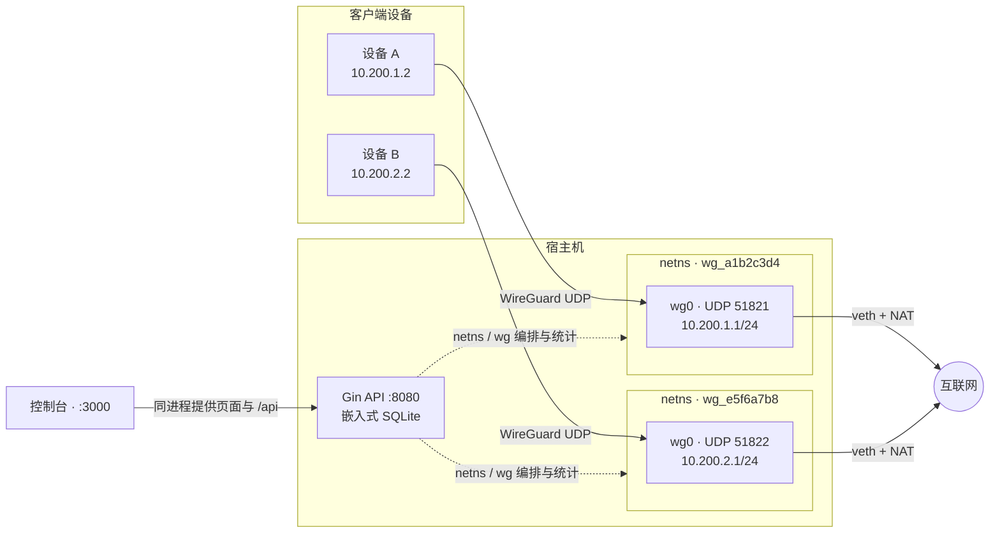

# WireGuard Manager

> 多用户 WireGuard 管理平台：账号级网络命名空间隔离，设备配置一键下发，流量与在线状态实时可见。

[](https://github.com/ChouHX/WireguardManager/actions/workflows/build-images.yml)
[](LICENSE)
[](https://go.dev)
[](https://react.dev)
[](https://mantine.dev)
[](https://github.com/ChouHX/WireguardManager/pkgs/container/wireguardmanager-backend)

## 目录

- [特性](#特性)
- [架构](#架构)
  - [网络资源模型](#网络资源模型)
- [快速开始](#快速开始)
- [配置参考](#配置参考)
  - [配置项](#配置项)
  - [环境变量](#环境变量)
  - [客户端配置](#客户端配置)
- [API](#api)
- [目录结构](#目录结构)
- [本地开发](#本地开发)
- [常用命令](#常用命令)
- [常见问题](#常见问题)
- [安全提示](#安全提示)
- [许可证](#许可证)

## 特性

- **账号级隔离** —— 每个账号独享一个 network namespace、独立的 WireGuard 接口与监听端口，互不可见、互不干扰。
- **自动化编排** —— 注册即自动创建命名空间、veth 对、wg 接口、路由与 iptables 规则；任一步失败自动回滚，不留半成品。
- **设备即开即用** —— 一键生成客户端配置，支持 `.conf` 下载与二维码扫码导入，转发出口自动探测。
- **秒级在线感知** —— 依据 WireGuard 自身的握手状态判定，客户端零 Agent：握手新鲜即刻在线，握手过期需连续确认才判离线，不受客户端防火墙与路由差异影响。
- **流量与资源监控** —— 设备握手状态、收发流量、系统 CPU / 内存 / 磁盘 / 网络趋势一屏掌握。
- **精细管控** —— 设备粒度限速、启用禁用、网关转发模式、AllowedIPs 网段自定义，支持为单个设备启用预共享密钥（PSK）以增强抗中间人与抗量子能力。
- **配置即改即生效** —— 网段、出口网卡、公网 IP、DNS、监控与在线判定参数都在管理界面「系统设置」中调整并持久化到数据库；`config.yaml` 只保留监听端口、数据库路径、JWT 密钥等启动必需项。
- **现代控制台** —— React 19 + Mantine，紧凑式布局、明暗主题、中英文双语、移动端自适应。
- **轻量部署** —— 嵌入式 SQLite（纯 Go 驱动，无需 CGO、无需独立数据库服务）；支持单容器部署，一个进程同时提供控制台与 API。镜像由 CI 构建并推送 GHCR。

## 架构


```mermaid
flowchart LR
  subgraph clients["客户端设备"]
    D1["设备 A<br/>10.200.1.2"]
    D2["设备 B<br/>10.200.2.2"]
  end

  subgraph host["宿主机"]
    direction TB
    subgraph ns1["netns · wg_a1b2c3d4"]
      W1["wg0 · UDP 51821<br/>10.200.1.1/24"]
    end
    subgraph ns2["netns · wg_e5f6a7b8"]
      W2["wg0 · UDP 51822<br/>10.200.2.1/24"]
    end
    API["Gin API :8080<br/>嵌入式 SQLite"]
  end

  WEB["控制台 · :3000"]
  INET((互联网))

  D1 -- "WireGuard UDP" --> W1
  D2 -- "WireGuard UDP" --> W2
  W1 -- "veth + NAT" --> INET
  W2 -- "veth + NAT" --> INET
  WEB -- "同进程提供页面与 /api" --> API
  API -. "netns / wg 编排与统计" .-> ns1
  API -. "netns / wg 编排与统计" .-> ns2
```

- **后端**（Go + Gin + GORM）：以 host 网络运行，负责 WireGuard 操作、命名空间编排与数据持久化。
- **前端**（React + Vite + Mantine）：构建为静态产物，由后端一并托管（`WEB_ROOT` 模式），无需单独的 Web 容器。
- **数据库**（嵌入式 SQLite）：单文件持久化，随镜像一起部署，无需外部服务。
- **共享命名空间**（`/var/run/netns`）：宿主可直接管理容器创建的 netns。

### 网络资源模型

每个账号注册后自动获得以下资源，均由平台负责创建与回收：

| 资源 | 说明 |
| --- | --- |
| network namespace | `wg_<user_uid>`，账号独占，与其他账号完全隔离 |
| WireGuard 接口 | 命名空间内 `wg0`，监听端口从 `network.base_port` 起递增分配 |
| 隧道网段 | `10.<base_subnet>.<序号>.0/24`，服务端占 `.1`，设备从 `.2` 起顺序分配 |
| veth 对 | 宿主侧 ↔ 命名空间侧，承载隧道出入流量 |
| NAT / 转发规则 | 命名空间内 iptables `MASQUERADE` 与 `FORWARD` 规则 |
| 配置文件 | `/etc/wg_config/<user_uid>/wg0.conf` |

## 快速开始

前置条件：Linux 主机、root 或 sudo 权限、Docker 24+ 与 Docker Compose v2、`wireguard` 内核模块。

```bash
git clone https://github.com/ChouHX/WireguardManager.git
cd WireguardManager

cp .env.example .env
cp config.yaml.example config.yaml
# 至少需要修改 config.yaml 中的：
#   jwt.secret        换成随机长字符串
#   network.server_ip 服务器公网 IP
#   network.out_interface 网卡名（可用 ip route show default 查看）
```

启动服务（单容器：一个进程同时提供控制台与 API，只占一个端口）：

```bash
docker compose up -d                          # 默认：拉取 GHCR 预构建镜像（自动识别 docker-compose.yml）
docker compose pull && docker compose up -d   # 更新到最新镜像

# 本地从源码构建（使用 docker-compose.build.yml）
docker compose -f docker-compose.docker-compose.build.yml up -d --build

# 或使用带环境检查与部署自检的脚本（等价于上面两种，默认拉取镜像）
./deploy.sh
./deploy.sh --build
```

访问 `http://<SERVER_IP>:3000`，默认账号 `admin@platform.com` / `password`（**首次登录后请立即修改**）。

镜像标签可用 `WM_IMAGE_TAG` 指定，默认 `latest`，也可用 `sha-<短哈希>` 回滚到某次构建：

```bash
WM_IMAGE_TAG=sha-2df1b06 docker compose up -d
```

## 配置参考

### 配置项

配置分两层：**启动参数**只能写在 `config.yaml`（或 `WM_*` 环境变量），**运行时可调项**在管理界面「系统设置」中维护并持久化到数据库。完整示例见 [`config.yaml.example`](config.yaml.example)。

**启动参数**（改动需重启）：

| 键 | 默认值 | 说明 |
| --- | --- | --- |
| `server.port` | `3000` | 控制台与 API 共用端口 |
| `server.mode` | `release` | Gin 运行模式：`debug` / `release` / `test` |
| `server.cors_origins` | `["*"]` | 允许的跨域来源 |
| `database.path` | `./data/cloud_platform.db` | SQLite 文件路径 |
| `database.max_open_conns` | `1` | 连接数，1 表示串行访问，规避 `database is locked` |
| `database.busy_timeout_ms` | `5000` | 写锁等待超时 |
| `database.wal` | `true` | 是否启用 WAL 日志模式 |
| `jwt.secret` | 无 | **必填**，少于 8 字符会拒绝启动 |
| `network.config_dir` | `/etc/wg_config` | WireGuard 配置存放目录 |
| `default.admin_email` / `admin_password` / `admin_name` | 见示例 | 首次启动创建的管理员 |

**管理界面可调项**（「系统设置」页面，存库即时生效）：

| 分组 | 键 | 说明 |
| --- | --- | --- |
| 网络 | `network.server_ip` | 服务器公网 IP，下发到客户端 Endpoint |
| | `network.out_interface` | 出口网卡（界面可自动探测并改选） |
| | `network.base_subnet` / `base_port` | 隧道网段前缀与端口起始值 |
| | `network.dns` | 下发给客户端的 DNS |
| | `network.client_allowed_ips` | 客户端 AllowedIPs，留空按设备所在网段推导 |
| 监控 | `monitoring.interval_seconds` / `retention_hours` | 采样间隔与记录保留时长 |
| 在线判定 | `liveness.enabled` | 是否启用在线判定 |
| | `liveness.interval_seconds` / `handshake_timeout_seconds` / `offline_threshold` | 复核间隔、握手时效阈值、离线确认次数 |
| 鉴权 | `jwt.expire_hours` | 登录有效期 |
| 设备默认值 | `wireguard.default_preshared_key` | 新建设备是否默认启用预共享密钥 |

> 同名的 `WM_*` 环境变量仍可覆盖启动默认值；数据库中一旦存在该键，以界面上的值为准。

### 环境变量

所有配置项都可用 `WM_*` 环境变量覆盖，优先级高于 YAML，便于容器化与密钥注入。常用项：

```bash
WM_JWT_SECRET=...                    # 签名密钥
WM_SERVER_PORT=8080                  # 监听端口
WM_NETWORK_SERVER_IP=1.2.3.4         # 公网 IP
WM_NETWORK_OUT_INTERFACE=eth0        # 出口网卡
WM_DB_PATH=/root/data/cloud_platform.db
WM_LIVENESS_ENABLED=false            # 关闭在线判定
```

完整清单见 [`.env.example`](.env.example)。

### 客户端配置

下载的 `AllowedIPs` 默认按设备所在网段下发（服务端接口 `10.100.0.1/24`、设备分配到 `10.100.0.2` 时下发 `10.100.0.0/24`），只把 VPN 网段流量送进隧道。需要全局代理时：

```yaml
network:
  client_allowed_ips: "0.0.0.0/0, ::/0"
```

开启「网关转发」后，该设备可作为网关，让其他设备经它访问 AllowedIPs 中配置的网段；转发出口接口会自动探测默认路由，也可从下拉列表中改选。配置值支持逗号分隔的多个网段，启动时会校验格式。

## API

所有业务接口挂载在 `/api` 下（`/health`、`/ready` 除外），使用 `Authorization: Bearer <token>` 鉴权。

| 方法 | 路径 | 说明 |
| --- | --- | --- |
| `POST` | `/api/register` | 注册账号（自动创建网络环境，耗时数秒） |
| `POST` | `/api/login` | 登录并获取 Token |
| `GET` `PATCH` | `/api/me` | 查询 / 更新当前账号信息 |
| `GET` | `/api/wireguard/traffic` | 当前账号流量摘要（轮询接口，服务端带缓存） |
| `GET` `POST` | `/api/wireguard/peers` | 列出 / 新增设备 |
| `PATCH` `DELETE` | `/api/wireguard/peers/{id}` | 更新 / 删除设备 |
| `GET` | `/api/wireguard/peers/{id}/config` | 获取设备客户端配置 |
| `GET` | `/api/wireguard/interfaces` | 可用网络接口列表（含探测到的默认出口） |
| `GET` | `/api/wireguard/liveness` | 当前账号设备在线状态 |
| `GET` | `/api/admin/users` | 用户列表 |
| `PATCH` `DELETE` | `/api/admin/users/{id}` | 更新 / 删除用户 |
| `GET` | `/api/admin/wireguard/traffic` | 全部账号流量汇总 |
| `GET` | `/api/admin/wireguard/traffic/{id}` | 单个账号流量详情 |
| `GET` | `/api/admin/wireguard/liveness` | 各账号在线设备统计 |
| `PATCH` | `/api/admin/wireguard/servers/{id}/toggle` | 启用 / 禁用账号网络 |
| `PATCH` | `/api/admin/wireguard/servers/{id}/ratelimit` | 设置限速 |
| `DELETE` | `/api/admin/wireguard/servers/{id}` | 删除账号网络环境 |
| `GET` | `/api/admin/monitoring/*` | 系统监控（`system` `cpu` `memory` `disk` `network` `chart` `history` `stats`） |
| `GET` | `/health` `/ready` | 存活 / 就绪探针 |

## 目录结构

```
.
├── main.go                     # 入口：启动、路由装配、优雅关闭
├── config.yaml.example         # 配置样例
├── internal/
│   ├── config/                 # 配置加载、校验、环境变量覆盖
│   ├── database/               # SQLite 初始化与默认管理员
│   ├── handlers/               # HTTP 处理层
│   ├── middleware/             # 鉴权与用户缓存
│   ├── models/                 # 数据模型
│   ├── routes/                 # 路由注册
│   └── services/               # netns / WireGuard / 监控采样 / 存活探测
├── frontend/                   # React + Vite + MantineUI 源码
├── internal/routes/frontend.go # 由后端托管前端产物（WEB_ROOT 模式）
├── Dockerfile                  # 单容器镜像：Go 后端 + 前端产物 + wg 工具链
├── docker-compose.yml          # 默认编排：拉取 GHCR 镜像
├── docker-compose.build.yml    # 本地源码构建编排
├── wg_config/                  # 挂载至 /etc/wg_config
└── data/                       # SQLite 数据目录（容器内 /root/data）
```

## 本地开发

```bash
# 后端（涉及 netns / iptables，需要 root）
go mod tidy
sudo go run main.go

# 前端
cd frontend
npm install
npm run dev        # http://localhost:3000，自动代理 /api 到 localhost:8080

# 前端校验
npm run typecheck       # tsc --noEmit
npm run check:locales   # 校验中英文文案键一致

# 重置环境（删除全部 netns、WireGuard 配置与 SQLite 数据）
sudo ./scripts/cleanup_all.sh
```

后端测试：

```bash
go test ./internal/...
```

## 常用命令

```bash
docker compose ps                             # 查看服务状态
docker compose logs -f app                    # 跟踪服务日志
docker compose pull && docker compose up -d   # 更新到最新镜像
docker compose down                           # 停止服务
```

## 常见问题

**注册 / 首次启动比较慢？**
注册需要创建命名空间、veth 对、wg 接口并拉起路由与 NAT 规则，通常需要数秒；任一步失败会整体回滚，不会留下残留资源。

**在线状态是怎么判定的？**
读取 WireGuard 自身的 `last handshake`：距最近一次握手在 `liveness.handshake_timeout_seconds`（默认 180 秒）内即为在线，超过则连续确认 `offline_threshold` 次后转为离线。整个过程不向客户端发送任何探测包，客户端也无需安装 Agent。

**设备明明连着，为什么显示离线？**
先看设备列表里的「最后握手」时间：若它也在持续更新，说明隧道正常，此时在线状态会在下一次复核（默认 3 秒）内转为在线；若握手时间停滞，则是隧道本身已中断。需要更宽松的判定时，把 `handshake_timeout_seconds` 调大即可。

**忘记管理员密码？**
停掉服务，删除 `data/cloud_platform.db` 后重启，会重新创建默认管理员（同时也会清空所有数据）；或在数据库中直接更新 `password_hash`。

**如何备份数据？**
SQLite 数据都在 `data/` 目录，停服务后整体复制即可（建议连 `-wal`、`-shm` 一起复制）。

**可以多个后端副本共享同一数据库吗？**
SQLite 面向单实例部署设计。需要横向扩容时应改用支持并发的数据库，并重新评估 netns 的归属。

## 安全提示

- `jwt.secret` 必须替换为随机长字符串，默认示例值会被拒绝或告警。
- 默认管理员密码请在首次登录后立即修改。
- 后端需要 `privileged` 与 host 网络才能管理 netns、iptables，请仅在受控主机上部署，并限制控制台的网络暴露面（建议置于 TLS 反向代理之后）。
- 设备配置中包含私钥，下载链路应确保可信。

## 许可证

[Apache License 2.0](LICENSE)
