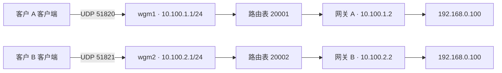

# WireGuard Manager

> 多用户 WireGuard 管理平台：每租户独立网卡、端口与路由表隔离，设备配置一键下发，流量与在线状态实时可见。

[](https://github.com/ChouHX/WireguardManager/actions/workflows/build-images.yml)
[](LICENSE)
[](https://go.dev)
[](https://react.dev)
[](https://mantine.dev)
[](https://github.com/ChouHX/WireguardManager/pkgs/container/wireguardmanager-backend)

## 目录

- [特性](#特性)
- [架构](#架构)
  - [网络资源模型](#网络资源模型)
- [快速开始](#快速开始)
- [配置参考](#配置参考)
  - [配置项](#配置项)
  - [环境变量](#环境变量)
  - [客户端配置](#客户端配置)
- [API](#api)
- [目录结构](#目录结构)
- [本地开发](#本地开发)
- [常用命令](#常用命令)
- [升级与灰度](#升级与灰度)
- [常见问题](#常见问题)
- [安全提示](#安全提示)
- [许可证](#许可证)

## 特性

- **账号级隔离** —— 每个账号独享 WireGuard 网卡、UDP 端口与策略路由表；不同租户可声明相同现场网段。
- **云端多实例** —— 网卡始终位于宿主网络，直接收发加密 UDP；不创建 namespace、veth 或 DNAT。
- **自动化编排** —— 注册时分配接口与端口；先建立防火墙隔离与路由规则，再启用接口；失败时回滚。
- **设备即开即用** —— 一键生成客户端配置，支持 `.conf` 下载与二维码扫码导入；新增 Windows Go + Wails + Mantine 客户端，登录拉取设备配置，自动探测网卡。
- **秒级在线感知** —— 纯 Go TCP 探测绑定租户网卡（`SO_BINDTODEVICE`），不再切换线程 namespace；结合接收流量判断设备在线状态。
- **流量与资源监控** —— 设备握手状态、收发流量、系统 CPU / 内存 / 磁盘 / 网络趋势一屏掌握。
- **精细管控** —— 设备粒度限速、启用禁用、默认转发（Windows 客户端自动探测局域网网卡）、AllowedIPs 网段自定义，支持为单个设备启用预共享密钥（PSK）以增强抗中间人与抗量子能力。
- **零配置部署** —— 开箱即用：JWT 密钥首次启动自动生成并随数据一起持久化，网络与监控等参数全部在管理界面「系统设置」中调整；部署侧无需任何配置文件。
- **现代控制台** —— React 19 + Mantine，紧凑式布局、明暗主题、中英文双语、移动端自适应。
- **轻量部署** —— 嵌入式 SQLite（纯 Go 驱动，无需 CGO、无需独立数据库服务）；支持单容器部署，一个进程同时提供控制台与 API。镜像由 CI 构建并推送 GHCR。

## 架构


```mermaid
flowchart LR
  CA["客户 A 客户端"] -->|UDP 51820| A["wgm1 · 10.100.1.1/24"]
  A --> TA["路由表 20001"] --> GA["网关 A · 10.100.1.2"] --> LA["192.168.0.100"]
  CB["客户 B 客户端"] -->|UDP 51821| B["wgm2 · 10.100.2.1/24"]
  B --> TB["路由表 20002"] --> GB["网关 B · 10.100.2.2"] --> LB["192.168.0.100"]
```

一个账号对应一个租户；不同租户可使用同一个现场网段。云端所有接口位于宿主网络，通过 `ip rule iif wgmN` 选择该租户路由表。**仅创建多个网卡并不能隔离重叠路由**：本实现用专属路由表解决选路，并用 `WGM-FORWARD` 链拒绝跨接口转发。网段缺少路由时返回 unreachable，不回落到宿主默认路由。

- 服务端 `AllowedIPs` = 设备隧道地址 `/32` + 该网关背后的现场网段。
- 同租户内允许 `wgmN → wgmN` 转发；禁止跨租户、租户到宿主公网出口、外部到租户的明文转发。`INPUT` 只允许发往本租户服务端隧道 IP 的 ICMP 与探测响应，阻止访问宿主其他地址和管理服务。
- `noprefixroute` 避免向主路由表写入隧道前缀；现场网段仅写入租户表。接口自己的本地 IP 仍由内核登记在 `local` 表。
- 宿主主动访问设备隧道 IP 时，通过 `iif lo to 10.100.N.0/24` 选择租户表，确保未绑定接口的普通 `ping` 也能正确选路。该规则只匹配本机发起的流量和唯一的隧道网段，不包含可能重叠的现场 LAN。
- 每租户使用独立 conntrack zone，避免相同源/目标五元组互相影响。每个隧道网卡设置宽松反向路径校验，避免重叠现场网段被 strict rp_filter 丢弃。
- 当前转发支持 IPv4；租户接口关闭 IPv6。现场地址不能与云端自身的本地 IP 重合；`10.100.0.0/16` 保留给隧道，不能作为现场网段声明。
- 后端为 Go + Gin + GORM，前端为 React。Windows 桌面客户端位于 [`client/`](client/README.md)，使用 Go + Wails + React + Mantine 与官方 WireGuardNT / winipcfg。

### 网络资源模型

| 资源 | 分配规则 |
|---|---|
| WireGuard 接口 | `wgm1` … `wgm254`；从隧道网段序号推导，避免与用户自建 `wg0` 混淆 |
| UDP 端口 | 从 `network.base_port`（默认 51820）顺序分配，避让已有占用 |
| 隧道网段 | `10.100.<序号>.0/24`；服务端 `.1`，设备从 `.2` 起分配 |
| 专属路由表 | `20000 + 序号`，保留范围 `20001..20254` |
| 策略规则优先级 | 入接口 `10000 + 序号`；绑定出接口的探测 `11000 + 序号`；服务端隧道源地址 `12000 + 序号`；本机访问隧道网段 `13000 + 序号` |
| conntrack zone | 与专属路由表编号相同 |
| 配置文件 | `/etc/wg_config/<user_uid>/wgmN.conf` 与 `private.key`（0600）；由管理器下发，不使用 wg-quick 启动服务端 |

宿主已有策略规则不得抢先匹配租户接口；保留上述接口名、路由表和规则优先级供本服务独占。云安全组及宿主 INPUT 需放行分配的 UDP 端口。默认 compose 不再挂载 `/var/run/netns`。

## 快速开始

前置条件：Linux 主机、root 或 sudo 权限、Docker 24+ 与 Docker Compose v2、`wireguard` 内核模块。

```bash
git clone https://github.com/ChouHX/WireguardManager.git
cd WireguardManager

docker compose up -d          # 无需任何配置
# 或使用带环境检查与部署自检的脚本
./deploy.sh
# 本地从源码构建
docker compose -f docker-compose.build.yml up -d --build
```

启动后使用内置默认值：端口 `3000`，数据写入 `./data`，JWT 密钥首次启动自动生成并保存到 `./data/jwt.secret`。

指定端口（三选一）：

```bash
WM_SERVER_PORT=8080 docker compose up -d    # 临时指定
echo "WM_SERVER_PORT=8080" >> .env          # 写进 .env（自动读取）
# 或直接改 docker-compose.yml 里的默认值
```

访问 `http://<SERVER_IP>:3000`，默认账号 `admin@platform.com` / `password`（**首次登录后请立即修改**）。

镜像标签可用 `WM_IMAGE_TAG` 指定，默认 `latest`，也可用 `sha-<短哈希>` 回滚到某次构建：

```bash
WM_IMAGE_TAG=sha-2df1b06 docker compose up -d
```

## 配置参考

### 配置项

全部参数都有内置默认值，**开箱即用、无需配置文件**。需要调整时：**部署相关**直接改 `docker-compose.yml`（或设环境变量），**运行相关**在管理界面「系统设置」中修改；非容器部署仍可选用 `config.yaml`。

**部署参数**（内置默认值，需要时再覆盖）：

| 变量 | 默认值 | 覆盖方式 |
| --- | --- | --- |
| 端口 | `3000` | `WM_SERVER_PORT=8080 docker compose up -d`，或写进 `.env`，或改 compose 默认值 |
| 数据目录 | `./data` | 改 `docker-compose.yml` 中 `./data:/root/data` 的左侧 |
| 配置目录 | `./wg_config` | 改 `docker-compose.yml` 中 `./wg_config:/etc/wg_config` 的左侧 |
| JWT 密钥 | 自动生成 | 首次启动写入 `data/jwt.secret`；也可用 `WM_JWT_SECRET` 显式指定 |
| 数据库路径 | `/root/data/cloud_platform.db` | 后端默认值，随数据目录挂载自动生效 |
| 管理员账号 | `admin@platform.com` / `password` | 首次启动创建，可用 `WM_DEFAULT_ADMIN_*` 覆盖 |
| 镜像版本 | `latest` | 改 `docker-compose.yml` 中 `image` 的标签，如 `sha-2648b94` |

**管理界面可调项**（「系统设置」页面，存库即时生效）：

| 分组 | 键 | 说明 |
| --- | --- | --- |
| 网络 | `network.server_ip` | 服务器公网 IP，下发到客户端 Endpoint |
| | `network.out_interface` | 出口网卡（界面可自动探测并改选） |
| | `network.base_subnet` / `base_port` | 隧道网段前缀与端口起始值 |
| | `network.dns` | 下发给客户端的 DNS |
| | `network.mtu` | 隧道接口 MTU，`0` = 沿用内核默认（1420）。链路 MTU 不足时必须调小，见「常见问题」 |
| 监控 | `monitoring.interval_seconds` / `retention_hours` | 采样间隔与记录保留时长 |
| 在线判定 | `liveness.probe_port` | 探测端口（唯一需要人工介入的参数） |
| 鉴权 | `jwt.expire_hours` | 登录有效期 |
| 设备默认值 | `wireguard.default_preshared_key` | 新建设备是否默认启用预共享密钥 |

> 同名的 `WM_*` 环境变量仍可覆盖启动默认值；数据库中一旦存在该键，以界面上的值为准。

### 环境变量

所有参数都可选用 `WM_*` 环境变量覆盖（优先级高于配置文件与内置默认值）。容器部署时最常用的是端口，compose 已默认透传这一项：

```bash
WM_SERVER_PORT=8080 docker compose up -d
```

其余变量未在 compose 中声明，需要时按同样格式加进 `environment:` 即可。

其余变量与其内置默认值可在 [`internal/config/config.go`](internal/config/config.go) 的 `defaultConfig()` 中查到；管理界面「系统设置」里的各项也都能用同名环境变量设定初始值（首次启动写入数据库后即以界面配置为准）。

### 客户端配置

平台设备表单仅填写 **设备局域网**（`allowed_ips`），例如 `192.168.0.0/24`。普通访问电脑可留空；WireGuard 隧道地址不会出现在该字段中，后台仍保留必需的自身 `/32`。同一租户内的重叠声明被拒绝，不同租户可以使用相同网段。

每个设备默认启用转发。平台不再提供转发开关、客户端网卡和客户端目标字段，也不再使用全局 `network.client_allowed_ips`。旧数据库列保留用于兼容，但不参与配置导出。新导出仅包含所属租户的隧道网段，不含 Linux `PostUp` / `PreDown` 脚本；`# WGM-Device-LAN` 注释提供设备局域网元数据。

Windows 客户端使用方法：

1. 为每个客户 / 现场创建独立租户，每台设备使用独立配置。操作电脑也需要自己的设备配置，不要复用正在运行的现场网关私钥。
2. 打开 [`Go + Wails + Mantine 客户端`](client/README.md)，登录构建时指定的管理平台。左侧列出当前账号的设备，右侧编辑当前电脑要使用的配置。
3. 现场网关填写下挂设备 IP 或局域网，可点击“探测本机局域网”填入建议。客户端将声明同步云端，并自动选择网卡、启用 IPv4 转发和限定范围的防火墙规则。
4. 远程电脑的设备局域网可留空，默认访问当前账号下其他设备声明的局域网。也可填写具体访问目标覆盖自动目标；本机与现场网段重叠时使用具体 `/32`。访问目标仅保存在本机。
5. 连接并等待握手。切换配置会先清理旧隧道和路由；跨客户时退出并登录对应账号。同一时刻只有一个隧道。关闭窗口隐藏到系统托盘并保持连接；双击恢复，右键可断开或退出。断开或退出程序会恢复网络设置。

现场网关会尝试创建 Windows NAT，让 VPN 电脑访问下挂设备时无需修改 PLC 的返回路由。若系统不支持 WinNAT，或已有 Docker / WSL 等 NAT，客户端保留现有网络并显示路由模式提示，此时仍需现场返回路由。局域网设备主动访问 VPN 时，需要将本机作为网关或配置相应路由。Linux / 官方 WireGuard 客户端仍需自行配置转发、防火墙及路由 / NAT。

Windows 包的构建、权限、DPAPI 加密存储、异常恢复及验收步骤见 [客户端说明](client/README.md)。当前仅支持 IPv4 分流，不提供公网出口或全局代理。

## API

所有业务接口挂载在 `/api` 下（`/health`、`/ready` 除外），使用 `Authorization: Bearer <token>` 鉴权。

| 方法 | 路径 | 说明 |
| --- | --- | --- |
| `POST` | `/api/register` | 注册账号（自动创建网络环境，耗时数秒） |
| `POST` | `/api/login` | 登录并获取 Token |
| `GET` `PATCH` | `/api/me` | 查询 / 更新当前账号信息 |
| `GET` | `/api/wireguard/traffic` | 当前账号流量摘要（轮询接口，服务端带缓存） |
| `GET` `POST` | `/api/wireguard/peers` | 列出 / 新增设备 |
| `PATCH` `DELETE` | `/api/wireguard/peers/{id}` | 更新 / 删除设备 |
| `GET` | `/api/wireguard/peers/{id}/config` | 获取设备客户端配置 |
| `GET` | `/api/wireguard/interfaces` | 可用网络接口列表（含探测到的默认出口） |
| `GET` | `/api/wireguard/liveness` | 当前账号设备在线状态 |
| `GET` | `/api/admin/users` | 用户列表 |
| `PATCH` `DELETE` | `/api/admin/users/{id}` | 更新 / 删除用户 |
| `GET` | `/api/admin/wireguard/traffic` | 全部账号流量汇总 |
| `GET` | `/api/admin/wireguard/traffic/{id}` | 单个账号流量详情 |
| `GET` | `/api/admin/wireguard/liveness` | 各账号在线设备统计 |
| `PATCH` | `/api/admin/wireguard/servers/{id}/toggle` | 启用 / 禁用账号网络（真实把隧道接口 down/up） |
| `PATCH` | `/api/admin/wireguard/servers/{id}/ratelimit` | 设置限速（在租户接口上用 `tc` 实际生效） |
| `DELETE` | `/api/admin/wireguard/servers/{id}` | 删除账号网络环境 |
| `POST` | `/api/admin/wireguard/users/{id}/server` | 为账号重新分配隧道（误删服务器后的补救） |
| `GET` | `/api/admin/monitoring/*` | 系统监控（`system` `cpu` `memory` `disk` `network` `chart` `history` `stats`） |
| `GET` | `/health` `/ready` | 存活 / 就绪探针 |

`/api/register` 与 `/api/login` 无需鉴权，因此默认启用按来源地址的限速（见下方「安全提示」）。

## 目录结构

```
.
├── main.go                     # 入口：启动、路由装配、优雅关闭
├── internal/
│   ├── config/                 # 配置加载、校验、环境变量覆盖
│   ├── database/               # SQLite 初始化与默认管理员
│   ├── handlers/               # HTTP 处理层
│   ├── middleware/             # 鉴权与用户缓存
│   ├── models/                 # 数据模型
│   ├── routes/                 # 路由注册
│   └── services/               # 多网卡 / WireGuard / 监控采样 / 存活探测
├── frontend/                   # React + Vite + MantineUI 源码
├── Dockerfile                  # 单容器镜像：Go 后端 + 前端产物 + wg 工具链
├── docker-compose.yml          # 默认编排：拉取 GHCR 镜像
├── docker-compose.build.yml    # 本地源码构建编排
├── wg_config/                  # 挂载至 /etc/wg_config
└── data/                       # 数据目录：SQLite 数据库 + 自动生成的 jwt.secret
```

## 本地开发

```bash
# 后端（涉及接口 / 策略路由 / iptables，需要 root）
go mod tidy
sudo go run main.go

# 前端
cd frontend
npm install
npm run dev        # http://localhost:3000，自动代理 /api 到 localhost:8080

# 前端校验
npm run typecheck       # tsc --noEmit
npm run check:locales   # 校验中英文文案键一致

# 重置环境（删除全部租户网络、WireGuard 配置与 SQLite 数据；会断开在线设备）
sudo ./scripts/cleanup_all.sh
```

后端测试：

```bash
go test ./internal/...
```

网络内核回归测试（只在临时 Docker 网络中创建测试接口，不使用宿主网络）：

```bash
bash scripts/test_network.sh
```

该测试使用本地 `ghcr.io/chouhx/wireguardmanager:latest` 镜像中的 `wg/ip/iptables/tc`，也可通过 `WGM_NETWORK_TEST_IMAGE` 指定镜像。覆盖重复现场地址、相同 TCP 五元组、跨租户阻断、启停及删除恢复、旧布局迁移和配置失败回滚。

## 常用命令

```bash
docker compose ps                             # 查看服务状态
docker compose logs -f app                    # 跟踪服务日志
docker compose pull && docker compose up -d   # 更新到最新镜像

# 彻底清理网络资源与本地数据（会断开全部在线设备，仅用于下架或重置）
sudo ./scripts/cleanup_all.sh --dry-run       # 先看将要执行什么
sudo ./scripts/cleanup_all.sh                 # 清理网络 + 数据 + 配置

# 只清网络、保留数据库与配置
sudo ./scripts/cleanup_all.sh --network-only
```

## 升级与灰度

升级前停止旧容器并备份 `data/`、`wg_config/`。从 namespace 版本首次迁移时，需要临时挂载历史 namespace 目录来释放旧网卡和 UDP 端口：

```bash
docker compose down
docker compose -f docker-compose.build.yml -f docker-compose.legacy-migration.yml up -d --build
docker compose -f docker-compose.build.yml -f docker-compose.legacy-migration.yml logs -f app
```

启动日志应显示每个账号已使用 `wgmN / UDP <原端口>`。迁移沿用数据库密钥、端口、隧道地址、设备、PSK、启停及限速设置，客户端无需更换凭据。迁移成功后移除临时挂载：

```bash
docker compose -f docker-compose.build.yml up -d
```

使用发布镜像时，将上述 `docker-compose.build.yml` 换成 `docker-compose.yml` 并省略 `--build`。数据库保留 `namespace` 字段仅作历史迁移标识，新布局通过 `network_mode = multi-interface` 记录。

启动会先重建接口、路由、防火墙并恢复设备，再开放 HTTP 和探测；因此**启动/升级期间隧道会短暂重连**。重建失败会阻止服务就绪并记录错误；设备恢复失败时将该接口保持 down。不要在迁移后直接回滚旧镜像：新接口与策略规则不会由旧版本识别；应停服务、清理新数据面并恢复备份。

验证示例（替换接口、源地址和目标）：

```bash
wg show wgm1
ip -4 rule show
ip -4 route show table 20001
ip -4 route get 10.100.1.2
ping -c 3 10.100.1.2
ip -4 route get 192.168.0.100 from 10.100.1.3 iif wgm1
ip -4 route get 192.168.0.100 from 10.100.2.3 iif wgm2
iptables -nvL WGM-FORWARD
```

相同目标在两个租户中应分别选择 `wgm1/table 20001` 与 `wgm2/table 20002`；从 A 访问 B 的隧道地址应失败。删除 A 后 B 应继续可用，主路由表不应出现现场路由。

## 常见问题

**注册 / 首次启动比较慢？**
注册需要创建租户接口并下发地址、专属路由与防火墙，通常在一两秒内完成；任一步失败会整体回滚，不会留下残留资源。

首次升级按上一节临时挂载历史 namespace，迁移会保留客户端凭据与监听端口。

**在线状态是怎么判定的？**
服务端每 1 秒绑定设备所属租户的网卡，向它的隧道地址加探测端口（`liveness.probe_port`，默认 49151）发起一次 TCP 连接：

1. 完成握手，或收到 `connection refused`（对端内核回 RST）→ **在线**，并显示往返耗时；
2. 探测无响应，但最近一轮**收到过**对端流量 → **在线**；
3. 两者都不满足 → 计一次失败，连续 2 次即判**离线**。

实测（真实 WireGuard 隧道）：**关闭客户端后约 4 秒转为离线**。

判定不设"流量保护窗口"，因此不需要等待任何保活周期；保活流量只作为探测失败时的辅助证据。

流量只统计**接收方向**（`rx`）：服务端每轮探测都会发出 TCP SYN，发送方向（`tx`）必然增长，若一并采信会让离线设备永远显示在线。

设备列表里会显示判定依据（探测有响应 / 隧道有流量 / 探测无响应），便于排查。

**隧道能建立，却传不动数据（对端"只发不收"）？**
先看设备列表里的**判定依据**，这一步就能分流掉大半：

- 依据是**「探测有响应」**——小包到设备隧道 IP 的往返正常；继续检查实际访问目标的路由、防火墙与 MTU。它不能证明现场 LAN 或所有应用端口均可访问。
- 依据是**「隧道有流量」**（探测无响应但 `rx` 在增长）——服务端收到对端流量，探测却没有回应；检查 peer 的 allowed-ips、选路与两端防火墙，不能仅凭此状态认定具体故障。
- 探测细节显示**「路由不可达」**——租户路由表内没有到该地址的路由，通常意味着设备的下挂网段没被下发。

**链路 MTU（最常见）**
隧道接口 MTU 默认 1420，这个值是照「底层链路 1500」定的。一旦本机所处的链路更窄（本机自身位于 IPIP / VXLAN / PPPoE 等通道之后是常见情形），加密封装后的报文就会超出链路容量：握手、探测这类**小包照常通过**，满长的数据包却发出即被丢弃。于是出现「能连上、却传不动数据」，而两端都不会报任何错。内核**不会**因为底层链路 MTU 变小而自动回退隧道 MTU。

服务端启动时会自检，不匹配就在日志里给出告警：

```
WARNING: 出口接口 eth0 的 MTU 为 1300，最多只能承载 1240 字节的隧道载荷，小于隧道当前的 MTU 1420。...
```

按提示把「系统设置 → 隧道 MTU」改成提示值（或设 `WM_NETWORK_MTU=1240`）即可。速算：**链路 MTU 减 60**（20 字节 IP + 8 字节 UDP + 32 字节 WireGuard）。例如链路 1300 → 填 1240，链路 1492 → 填 1432。

自己确认是不是这条：

```bash
# 绑定租户接口对比小包与大包（大包不通、小包通 => 基本确诊）
ping -I wgm1 -M do -s 1200 <对端隧道地址>   # 通
ping -I wgm1 -M do -s 1400 <对端隧道地址>   # 不通
```

`-M do` 表示禁止分片，必须用 iputils 的 `ping`（许多精简镜像里的 busybox `ping` 不支持该选项）。

**服务端 peer 的 allowed-ips**
服务端靠每个 peer 的 allowed-ips 决定「回程流量该发给谁」（cryptokey routing）。若其中缺少该设备的隧道地址，服务端**收得到**对端的包，回包却找不到出口，只能丢弃——对端因此表现为「只发不收」，而服务端因为持续收到流量（`rx` 增长）仍判定它**在线**。这正是上表里「隧道有流量」那一行的成因。

服务端启动收敛时会按数据库记录重新下发，因此修法是：先确认数据库里该设备的隧道地址与网段是否完整，再触发一次收敛（重启服务）或改动该设备配置让它重新下发。注意启动收敛会**跳过已就绪的账号**，所以只改数据库不会立刻生效。

**关于保活（PersistentKeepalive）**
服务端会为每台设备设置 10 秒的保活。这是必要的：WireGuard 客户端的保活定时器只有在**收到对端数据包**后才会续期（内核的 `timer_need_another_keepalive` 标志），服务端若从不主动发包，客户端会在首个保活之后停止发送，直到 120 秒重协商才恢复——表现为"设了 25 秒却两分钟才动一次"。双向保活后客户端的保活才会持续生效。

**为什么探测必须绑定租户接口？**
租户路由只存在于专属路由表。Go 探测通过 `SO_BINDTODEVICE` 与 `oif` 策略规则选择正确租户，尤其是不同租户的现场 LAN 地址重复时。唯一的设备隧道 IP 另有本机目标策略规则，普通宿主程序无需绑定也可访问；现场 LAN 仍需绑定接口。不再使用 `setns` 或锁定线程。

若旧版本上 `ping -I wgm1 10.100.1.2` 可达，而普通 `ping 10.100.1.2` 不通，请更新服务端镜像并重建容器。新版本自动补齐 `13001: from all to 10.100.1.0/24 iif lo lookup 20001` 规则；只更新桌面客户端不会修复云端选路。客户端到 `10.100.1.1` 的 ping 回包由已有源地址规则负责，若仍不通还需检查实际收发包和两端防火墙。

**设备 A 访问不到设备 B 背后的局域网？**
跨网段转发需要服务端网关 peer 的 AllowedIPs、租户路由表和防火墙、客户端目标路由及网关转发/NAT 一起生效。平台处理云端部分；“设备局域网”声明网关侧 LAN，目标地址由客户端本地填写，网卡自动探测。Windows 客户端自动配置转发、防火墙并尝试 NAT；路由模式下仍需现场返回路由。

**能让设备把所有流量都从服务器出去吗（全局代理）？**
当前架构仅支持租户内部互访和现场网段接入；没有默认出口路由，防火墙也会拒绝租户到公网的转发。设置全流量 AllowedIPs 不会启用公网代理。

**为什么判定不参考握手时间？**
`last handshake` 在客户端断开后**不会被清空，只是停住**，而它又只在密钥重协商时更新（默认 120 秒）。拿它当在线依据，会让离线判定滞后一个重协商周期——这是早期版本"设备断开很久仍显示在线"的根因，现已完全移除该依据，只依赖实时探测与流量增量。

**设备明明连着，为什么显示离线？**
看设备列表里的探测时延：能显示出毫秒数就是在线的。持续离线通常是隧道本身中断（客户端退出、网络切换、NAT 映射失效），也可能是客户端防火墙丢弃了隧道内的探测包——后者可把 `traffic_stale_seconds` 调大，让保活流量继续维持在线状态。

**忘记管理员密码？**
停掉服务，删除 `data/cloud_platform.db` 后重启，会重新创建默认管理员（同时也会清空所有数据）；或在数据库中直接更新 `password_hash`。

**JWT 密钥放在哪？**
未显式配置时，后端首次启动会生成一个随机密钥并写入 `data/jwt.secret`（权限 0600），之后每次启动复用同一个密钥，因此重启不会导致登录失效。**备份数据时请连同这个文件一起复制**；若它丢失，所有已签发的 Token 会失效，用户需要重新登录。想自己掌控密钥时，设置 `WM_JWT_SECRET` 即可覆盖（优先级高于文件）。若数据目录不可写，后端会退回进程内临时密钥并打印告警，服务仍可启动，但重启后需要重新登录。

**如何备份数据？**
SQLite 数据与 JWT 密钥都在 `data/` 目录，停服务后整体复制即可（建议连 `-wal`、`-shm` 一起复制）。

**可以多个后端副本共享同一数据库吗？**
SQLite 面向单实例部署设计。需要横向扩容时应改用支持并发的数据库，并重新设计接口、端口、路由表的归属。

## 安全提示

- JWT 密钥默认自动生成并持久化到 `data/jwt.secret`（0600）；若通过 `WM_JWT_SECRET` 显式指定，请使用足够长的随机字符串。
- 默认管理员密码请在首次登录后立即修改。修改密码需要在「个人资料」中同时提交当前密码（服务端会校验），避免 Token 泄漏直接升级为账号接管。
- `/api/register` 与 `/api/login` 无需鉴权，默认启用按来源地址的限速：登录 `10 次/分钟`，注册 `5 次/小时`（注册会占用隧道网段，故严格得多）。可用 `WM_RATE_LIMIT_LOGIN_PER_MINUTE`、`WM_RATE_LIMIT_REGISTER_PER_HOUR` 调整，`WM_RATE_LIMIT_ENABLED=false` 关闭。
- **限速依赖来源地址的准确性**：Gin 默认信任所有来源，任何客户端都能用 `X-Forwarded-For` 伪造地址绕过限速。本项目已默认改为不信任任何代理；**若你确实在反向代理之后部署，必须显式声明代理地址**，否则所有请求都会被记为代理自身的地址：

  ```bash
  # 容器部署：加进 compose 的 environment
  - WM_TRUSTED_PROXIES=172.18.0.1
  ```

  跨域来源同理可用 `WM_CORS_ORIGINS`（逗号分隔）显式收窄，默认放行全部来源时启动日志会给出提示。
- 后端使用 host 网络管理 WireGuard、iptables 和策略路由；默认保留 privileged 以写入宿主转发及接口 sysctl。运行时不再共享 namespace 挂载。请仅在受控主机部署，并限制控制台暴露范围。
- 容器健康检查指向 `/ready`（会真正 Ping 数据库），而非无条件返回 200 的 `/health`。
- 设备配置中包含私钥，下载链路应确保可信。

## 许可证

[Apache License 2.0](LICENSE)
